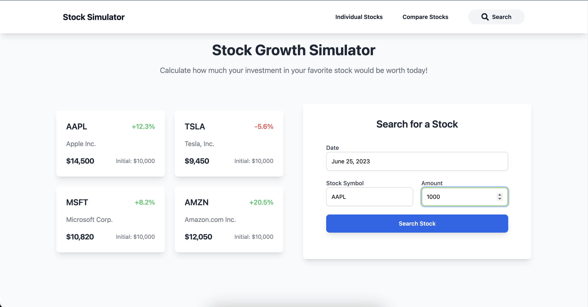
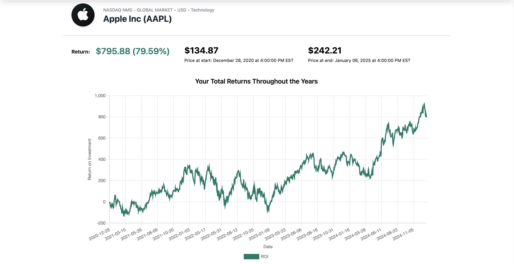
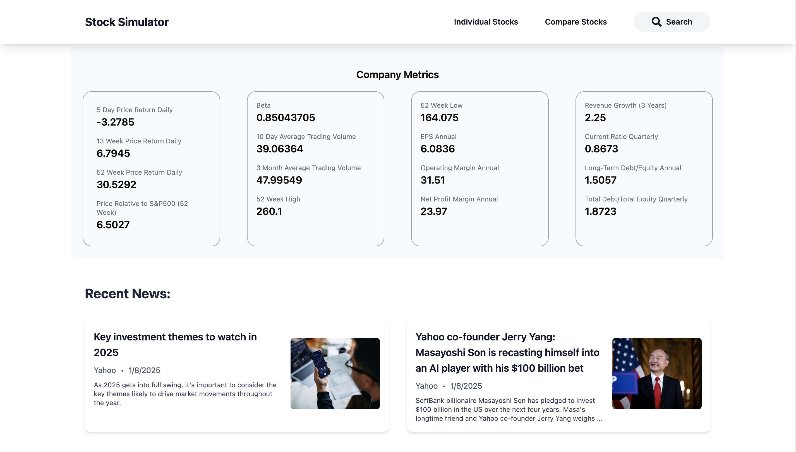
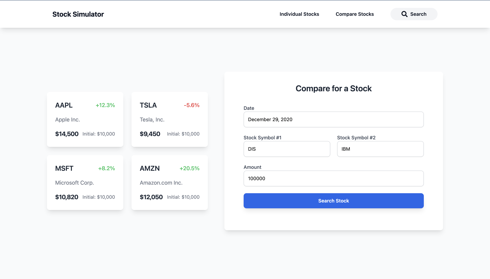
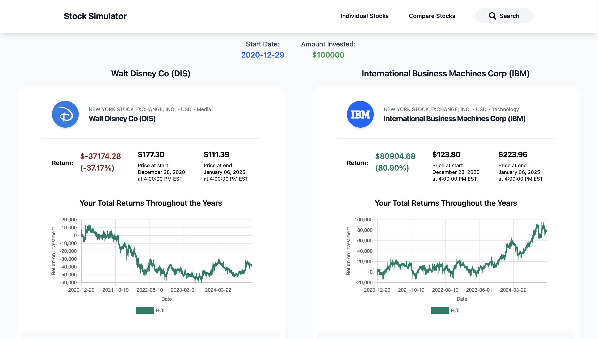
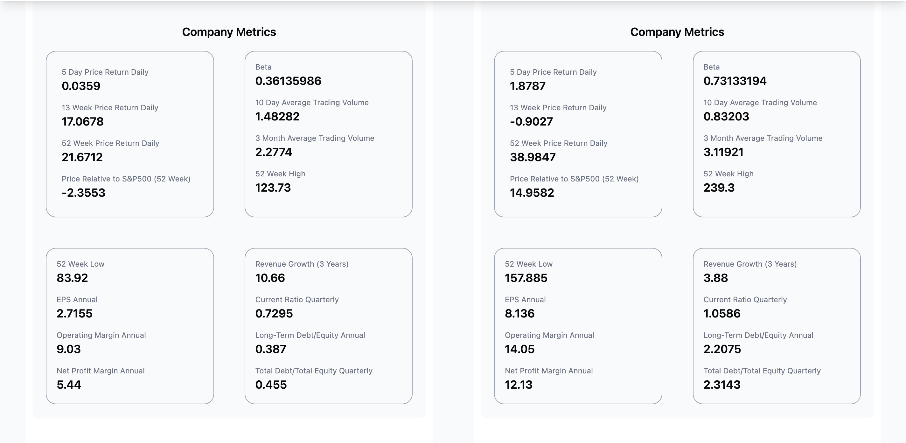
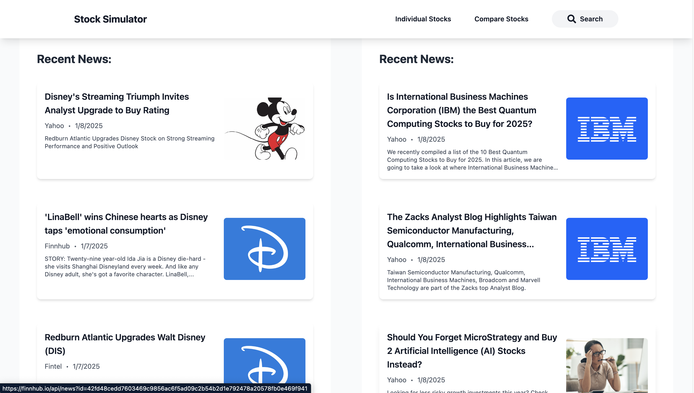

# Stock Stimulator


**Stock Stimulator** is a web application that allows users to calculate how much money they would have made if they had invested in a stock at a specific year. It enables stock comparisons by tracking the value progression of multiple stocks, providing key stock information, performance metrics, and recent news.

## Features

- **Stock Investment Simulator:** Calculate the growth of an initial investment in a stock over a selected period.
- **Stock Comparison:** Compare the historical performance of two stocks side-by-side. 
- **Profit Progression:** Generates tailored study sheets to study the focus areas
- **Stock Metrics:** Provides a unique timeline from easy to difficult for each focus area
- **Recent News:** Automatically fetches job descriptions directly from provided URLs through webscraping


## Technologies Used

- **React** and **TailwindCSS**: Frontend interface, logic, and design
- **SpringBoot** & **Spring**:  Application core logic and HTTP API call
- **JUnit** & **Mockito**:  Application Unit Testing


## Preview
<p align="center" width="100%">
  
    
</p>

<p align="center" width="100%">
  
    
  
  
  

</p>

## Demo Video

[](https://youtu.be/wPncd4D11Zw)


Click the image to watch the demo video on YouTube.

## Environment Variables

This project requires an **API key** for accessing the **Alpha Advantage API** and the **Finnhub API**. The key is stored securely in a `.env` file. Follow the steps below to configure your environment:

### **Setup Instructions**

1. **Create the `.env` file**  
   Copy the provided `.env.template` file in the server repository and rename it to `.env`:  
   ```bash
   cp .env.template .env
2. Add Your API Key
   Open the .env file in your preferred editor and replace #your-google-api-key with your actual API key:
   ```bash
   alpha_advantage_key=YOUR-API-KEY
   finnhub_token=YOUR-API-KEY
   ```

   Example Configuration:
   ```bash
   alpha_advantage_key=AIzaSyEXAMPLE12345
   ```
3. Save and Close
   Make sure to save the changes before closing the file.

## Installation

1. Clone the repository:  
   ```bash
   git clone https://github.com/jasonjiang9142/cramify.ai.git
   cd client
   ```

2. Install dependencies for the client and server:
   Frontend 
   ```bash
   cd client
   npm install
   npm run dev
   ```

   Backend 
   ```bash
   cd server
   ./mvnw spring-boot:run
   ```


## Running Tests

The project uses **JUnit5 and Mockito** for testing. Follow these steps to execute the tests:

1. Navigate to the server directory:  
   ```bash
   cd server
   ```

2. Run the test  
   ```bash
   mvn test
   ```


## Contributing

Contributions are welcome! If you'd like to improve StockStimulator, please fork the repository, make changes, and submit a pull request.


## License

This project is licensed under the [MIT License](LICENSE).  

